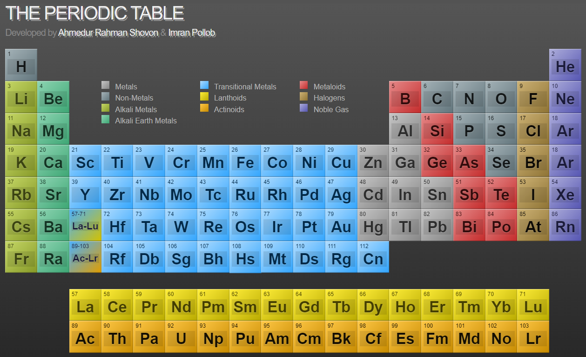
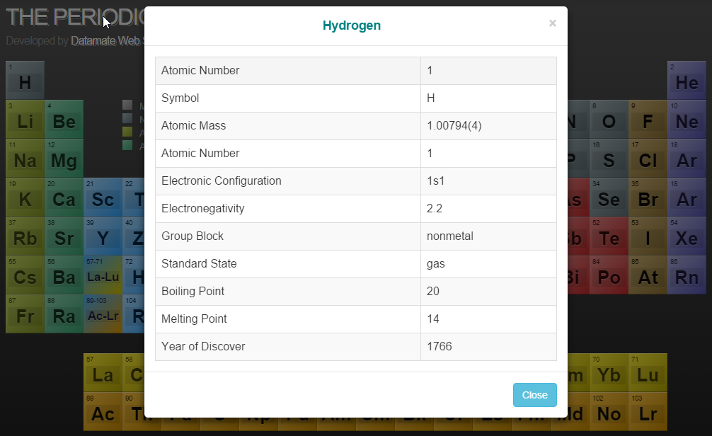

## Periodic Table: [Live demo](https://arshovon.com/apps/periodic_table/)

The periodic table is a tabular arrangement of the chemical elements, ordered by their atomic number (number of protons in the nucleus), 
 electron configurations, and recurring chemical properties. The table also shows four rectangular blocks: s-, p- d- and f-block. 
 In general, within one row (period) the elements are metals on the lefthand side, and non-metals on the righthand side.

Periodic Table is a single page applicaion (SPA) that contains the periodic table with details information about all chemical elements. 
 Hopeful the students find this interesting.

### Periodic Table Demo
- Live demo: [https://arshovon.com/apps/periodic_table/](https://arshovon.com/apps/periodic_table/)
- Full table:
 
- Detail view:
 

### How to use

- Move the mouse over any element to show its basic information like name and mass.
- Click any element to show its detail information appears as popup.

### Developer

- [Ahmedur Rahman Shovon](https://arshovon.com/)
- [Imran Pollob](https://imranpollob.com/)
